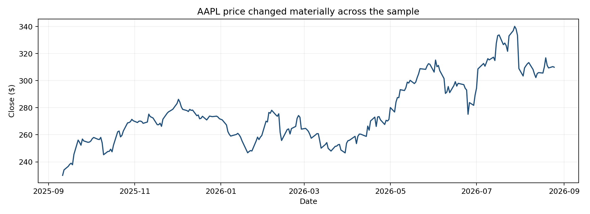
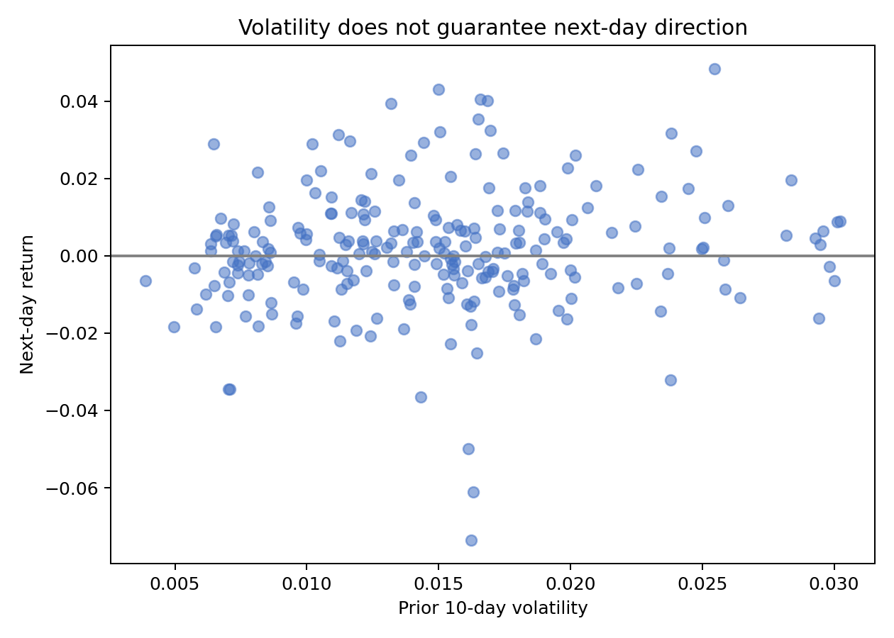
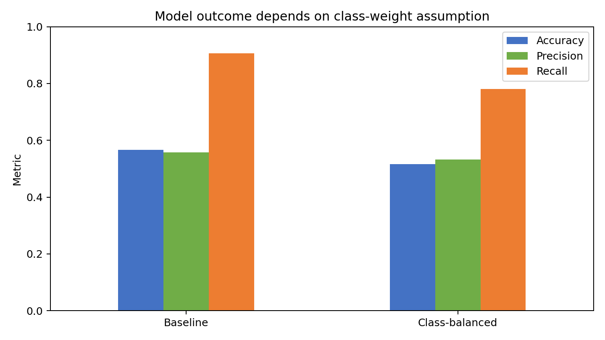

# AAPL Direction Baseline: Decision Report

## Executive summary
- Do **not** deploy the model as a stand-alone trading rule; test accuracy is 56.7% on a short chronological holdout.
- Class weighting changes recall by -12.5%, so operating results depend on the cost assigned to missed up-days.
- Use this transparent baseline to design longer, cost-aware backtests and monitoring—not to claim stable predictability.

## Price context

The sampled price level changes through time, so results may be regime-specific. The chart describes history and does not imply continuation.

## Risk structure

Prior volatility shows broad dispersion in next-day outcomes rather than a dependable directional rule. Extreme periods are sparse.

## Sensitivity analysis

| Metric | Baseline | Class-balanced | Change |
|---|---:|---:|---:|
| Accuracy | 0.567 | 0.517 | -0.050 |
| Precision | 0.558 | 0.532 | -0.026 |
| Recall | 0.906 | 0.781 | -0.125 |

## Assumptions & risks
The next period is assumed to resemble the single-ticker training year; all features must be available before prediction. Risks include regime change, small sample size, transaction costs, class imbalance, and data revisions. Metrics are predictive—not causal—and do not quantify portfolio loss.

## What this means for you
Treat any signal as experimental. Require a longer walk-forward test, transaction-cost and drawdown analysis, uncertainty intervals, and volatility-regime monitoring before capital allocation. Choose class weighting only after specifying whether false positives or missed up-days are more costly.
