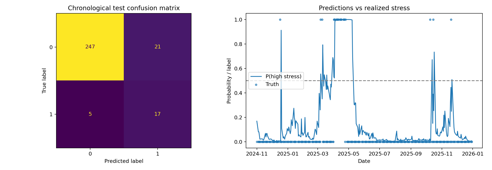
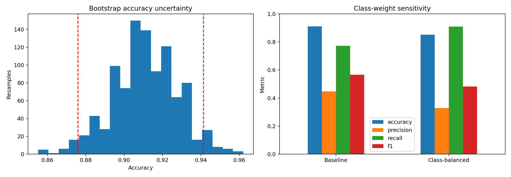

# Multi-Asset Market Stress — Stakeholder Report

## Executive summary
- The model is an interpretable review trigger, not a trading system.
- Chronological test accuracy is 91.0%, recall is 77.3%, with bootstrap accuracy CI 87.6%–94.1%.
- Class balancing changes recall from 77.3% to 90.9%; the operating threshold must reflect the cost of missed stress.

## Assumptions and risks
Past SPY/VIX/TLT/GLD relationships are assumed informative, inputs timely, and VIX≥25 or SPY≤−2.5% a useful stress definition. Regime drift, rare events, time dependence, data revisions, and mismatch with the actual portfolio can invalidate results.

## Decision implication
Use the score to trigger analyst review. Do not change allocation automatically. Extend walk-forward validation, calibrate probabilities, incorporate portfolio loss and transaction costs, and monitor freshness, drift, recall, latency and alert volume before production.
